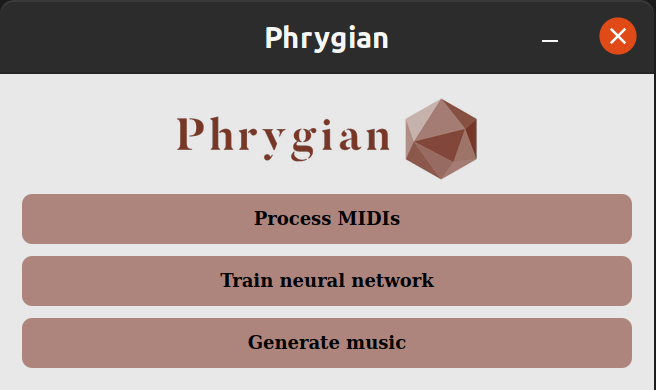
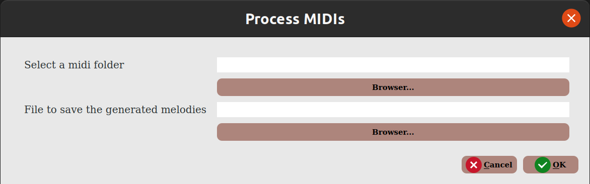
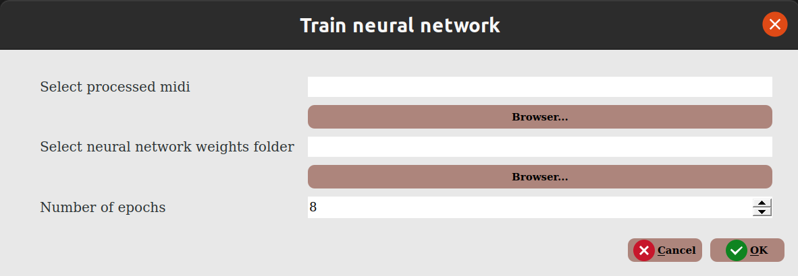
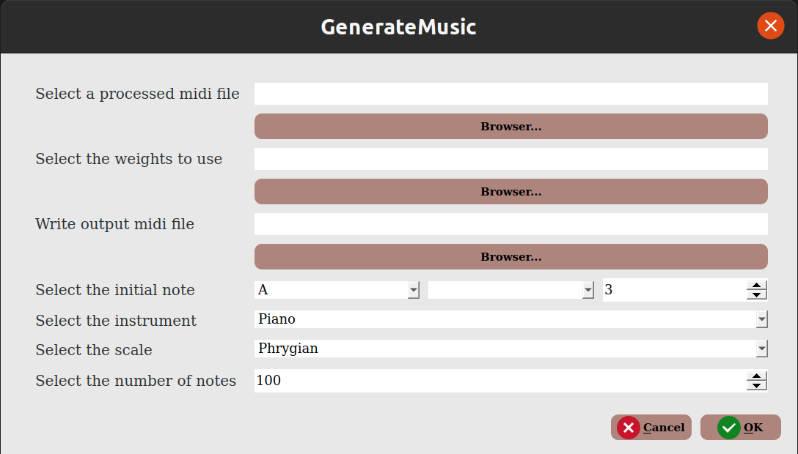

# Phrygian - An Artificial Intelligence system for Music Composition <!-- omit in toc -->

## Table of Contents  <!-- omit in toc -->
- [Authors](#authors)
- [Requirements](#requirements)
- [Installation](#installation)
- [Execution](#execution)
  - [Phrygian CLI](#phrygian-cli)
    - [Main program](#main-program)
    - [Process midi files](#process-midi-files)
    - [Train neural network](#train-neural-network)
    - [Generate music](#generate-music)
  - [Phrygian GUI](#phrygian-gui)
    - [Main program](#main-program-1)
    - [Process midi files](#process-midi-files-1)
    - [Train neural network](#train-neural-network-1)
    - [Generate music](#generate-music-1)
- [Appendix](#appendix)

## Authors
  * Daniel del Castillo de la Rosa
  * José Daniel Escánez Expósito
  * Nerea Rodríguez Hernández

## Requirements
  * [Python 3](https://www.python.org/downloads/)
    * Modules:
        - [tensorflow](https://www.tensorflow.org/install)
        - [music21](https://web.mit.edu/music21/doc/installing/)
        - [keras](https://keras.io/about/#installation-amp-compatibility)
        - [numpy](https://numpy.org/install/)
        - [pyqt5](https://pypi.org/project/PyQt5/)
  * [Musescore 3](https://musescore.org/en/download)


## Installation

```bash
$ git clone https://github.com/alu0101215693/Phrygian.git
```

## Execution
### Phrygian CLI
#### Main program
```bash
$ src/phrygian.py [-h|--help] process|train|generate
```
#### Process midi files
```bash
$ src/phrygian.py process [-h|--help] <midi files folder> <output file>
```
#### Train neural network
```bash
$ src/phrygian.py train <processed midis file> <neural network weights folder> <number of epochs>
```
#### Generate music
```bash
$ src/phrygian.py generate <processed midis file> <neural networks weights> <output midi file>

Optional arguments should be added at the end
Initial pitch (Default A3): [(-p|--pitch) <pitch>] 
Instrument (Default Piano): [(-i|--instrument) <instrument>]
Scale (Default Chromatic): [(-s|--scale) <scale>] 
Number of notes (Default 100): [(-n|--notes) <number of notes>] 
```
  * See [Appendix](#appendix) for available instruments and scales

### Phrygian GUI
#### Main program
```bash
$ src/phrygian_gui.py
```

#### Process midi files

#### Train neural network

#### Generate music


## Appendix
* Available instruments: 
```
Accordion, AcousticBass, AcousticGuitar, Agogo, Alto, AltoSaxophone, Bagpipes,
Banjo, Baritone, BaritoneSaxophone, Bass, BassClarinet, BassDrum, BassTrombone,
Bassoon, BongoDrums, BrassInstrument, Castanets, Celesta, Choir, ChurchBells,
Clarinet, Clavichord, Conductor, CongaDrum, Contrabass, Contrabassoon, Cowbell,
CrashCymbals, Cymbals, Dulcimer, ElectricBass, ElectricGuitar, ElectricOrgan,
ElectricPiano, EnglishHorn, FingerCymbals, Flute, FretlessBass, Glockenspiel,
Gong, Guitar, Handbells, Harmonica, Harp, Harpsichord, HiHatCymbal, Horn,
Kalimba, KeyboardInstrument, Koto, Lute, Mandolin, Maracas, Marimba,
MezzoSoprano, Oboe, Ocarina, Organ, PanFlute, Percussion, Piano, Piccolo,
PipeOrgan, PitchedPercussion, Ratchet, Recorder, ReedOrgan, RideCymbals,
Sampler, SandpaperBlocks, Saxophone, Shakuhachi, Shamisen, Shehnai, Siren,
Sitar, SizzleCymbal, SleighBells, SnareDrum, Soprano, SopranoSaxophone,
SplashCymbals, SteelDrum, StringInstrument, SuspendedCymbal, Taiko, TamTam,
Tambourine, TempleBlock, Tenor, TenorDrum, TenorSaxophone, Timbales, Timpani,
TomTom, Triangle, Trombone, Trumpet, Tuba, TubularBells, Ukulele,
UnpitchedPercussion, Vibraphone, Vibraslap, Viola, Violin, Violoncello,
Vocalist, Whip, Whistle, WindMachine, Woodblock, WoodwindInstrument, Xylophone
```

* Available scales:
```
Chromatic, Octatonic, Hexatonic-Whole-Tone, Hexatonic-Blues, Pentatonic,
Pentatonic-Blues, Neapolitan-Major, Neapolitan-Minor, Flamenco, Minor, Ionian,
Dorian, Phrygian, Lydian, Mixolydian, Aeolian, Locrian, Enigma
```
